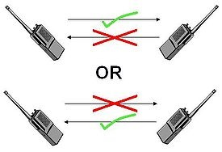
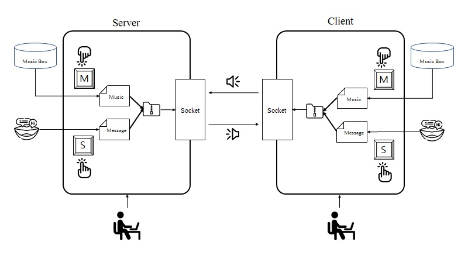
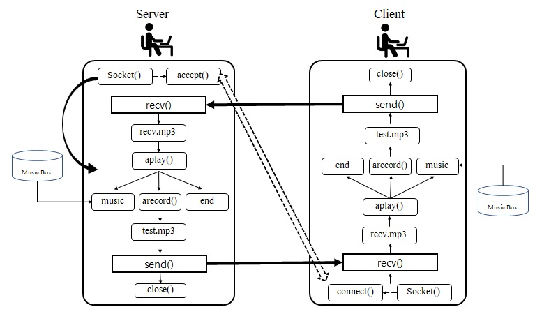

# Our_Walkie_Talkie :pager:  

2021 가을학기 <시스템 프로그래밍> Term Project

## A. 프로젝트명 : <Our_Walkie_Talkie>
  
## B. 프로젝트 멤버 이름 및 멤버 별로 담당한 파트에 대한 소개

### 프로젝트 멤버
* 빅데이터학과 20195168 박서정    
* 빅데이터학과 20195188 송지원

       
    
먼저 전체 프로그램을 짜기 위해 구현해야한 항목은 다음과 같습니다.    
- 서로 다른 노트북 간의 통신
- 음성 파일 녹음 및 출력
- 음성 파일 전송 및 수신
- 음악 파일 불러와 전송
- 음성 파일 수신 시 비블록킹을 위한 thread 구현

#### 20195168 박서정
위의 과정 중에서 담당한 과정으로는   
>   서로 다른 노트북 간의 통신    
>   음성 파일 전송 및 수신    
>   음악 파일 전송    
>   음성 파일 수신 thread 구현    

#### 20195188 송지원  
>   서로 다른 노트북 간의 통신   
>   음성 파일 녹음 및 출력    
>   음성 파일 전송 및 수신    
>   프로그램 종료 절차  

## C. 프로젝트 소개 및 개발 내용 소개
  

오늘날 대부분의 학생들은 또는 직장인들은 수업과 업무를 위해 화상 채팅을 해본 경험이 있을것이다.    
그 사용도가 증가함에 따라 개인적인 공간에서의 소음이 상대에게 의도치 않게 전달됨으로 발생하는 여러 불편한 상황을 마주하게 된다.   
이에 우리는 특정 키를 눌렀을 때에만 소리가 송출되도록 하는 <무전기>방식의 프로그램을 기획하였다.   

#### 개발 의의
수업 시간에 배운 소켓 통신은 개인의 컴퓨터 한 대를 이용하여 문자열 전송을 하는 통신이었다.    
하지만 사실상 대부분의 소켓 통신이 이용되는 곳은 하나의 컴퓨터 내부에서 실행되지 않으며 그 형식 또한 다양하다.    
우리는 실습에서 배운 내용을 기초로 하여 실제적으로 사용가능한 음성 통신 프로그램을 기획하였다.  
또한 ip주소 체계에 대한 개념을 잡고 이를 응용하기 위해 나름의 공부를 진행하였다.   
백문이 불여일견이라는 고사성어의 뜻과 같이 이번 프로젝트를 통해 소켓 통신을 머리로만 이해하는 것이 아닌   
몸소 경험해 보고자 한다.   
또 팀원 간의 협업을 통해 다수가 참여하는 프로젝트에서 본인이 취해야 할 자세를 배우기도 하였다.  

##### 전체적인 진행 과정 

1. 무전기는 우리가 흔히 알고 있듯이 half-duplex (반이중 통신)방식의 통신을 지원한다.   
따라서 우리는 양쪽이 모두 전송과 수신이 가능하지만 한 번에 하나의 기기만이 전송할 수 있도록 전역 변수를 통해 제어한다.   
2. 또한 특정 키 's'를 입력했을 시에 5초간 녹음이 되어 파일 형태로 저장이 된 후 파일의 내용을 읽어 전달하는 형태로 구현하였다.     
여기에서 리눅스의 모든 것은 파일이라는 말이 있듯 음성 파일 또한 여느 파일의 전송 형태와 동일하게 파일을 열고 읽을 수 있다.     
또는 'm'을 입력하여 저장되어 있는 음악의 목록 중 하나를 선택하여 음악 파일을 읽어오거나,    
'q'를 입력하여 프로그램을 종료시킬 수 있다.     
3. 전송이 된 음성 파일 내용은 수신자 측에서 계속해서 수신 파일의 유무를 검사하는 thread 내부에서 수신되어 받는 즉시 재생이 된다.   
4. 수신자 측의 음성 녹음을 진행할 것인지를 입력을 통해 확인하고 음성 녹음 파일, 음악 파일, 종료 중 하나를 선택하게 된다.  
5. 위와 같은 과정이 양쪽 컴퓨터에서 반복해서 진행된다.  

## D. 프로젝트 개발 결과물 소개 (+다이어그램)

위의 구조도는 초기 구조도이다.     
현재 구현을 마친 지금 단계에서 확인해보았을 때 압축을 하지 않았다는 점이 다르다. 

## E. 개발 결과물을 사용하는 방법 소개 (+프로그램 구동 화면 스크린샷 첨부)
## F. 개발 결과물의 필요성 및 활용방안

우리의 프로그램의 필요성은 주제 선정 이유와 같다고 볼 수 있다.        
사실상 
